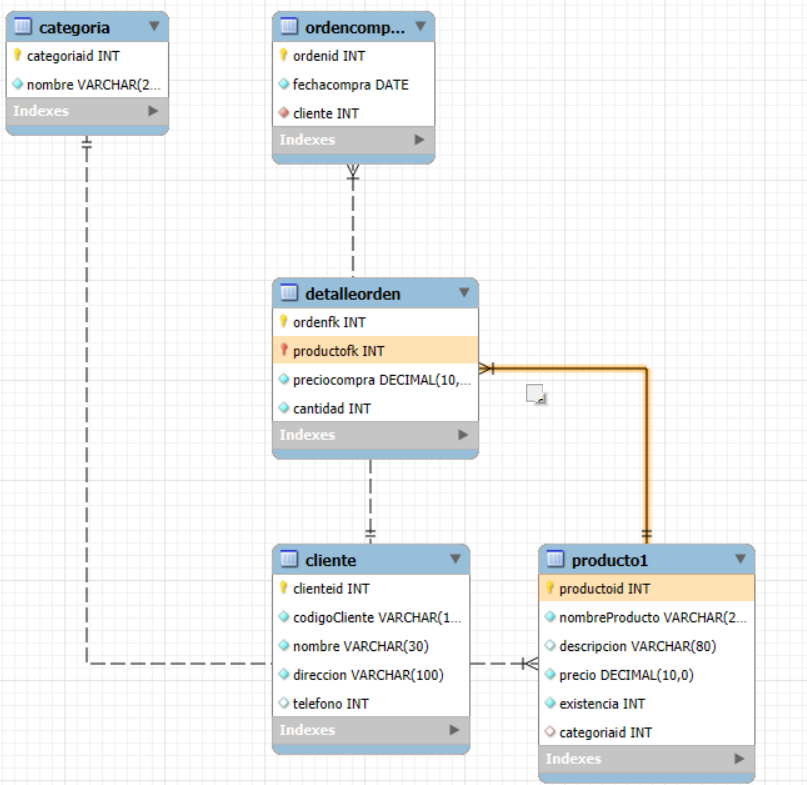

# ejerccios de creacion de datos SQL

```SQL 
create database Tienda;
use Tienda;
create table categoria(
categoriaid int not null,
nombre varchar(20) not null,
constraint pk_categoria
primary key (categoriaid),
constraint unico_nombre
unique (nombre)
);

insert into categoria
values (1, 'Carnes frias');

insert into categoria(categoriaid,nombre)
values(2, 'linea blanca');

insert into categoria(nombre,categoriaid)
values ('vinos y licores',3);

insert into categoria
values  (4, 'Ropa'),
        (5, 'Dulces'),
        (6, 'Lacteos');
       
insert into categoria(nombre, categoriaid)
values ('Panaderia', 7),
        ('Zapateria', 8),
        ('Jugueteria', 9);
       
insert into categoria
values (10, 'Panaderia');
       
select * from categoria;

-- Tabla productos
create table producto1(
  productoid int not null,
  nombreProducto varchar(20) not null,
  descripcion varchar(80) null,
  precio decimal(0.0) not null,
  existencia int not null,
  categoriaid int null,
  constraint pk_producto1
  primary key (productoid),
  constraint unico_descripcion
  unique(nombreProducto),
  constraint chk_precio
  check(precio>0.0 and precio<=1000),
  constraint chk_existencia
  check(existencia>0 and existencia<=200),
  constraint fk_categoria_producto1
  foreign key (categoriaid)
  references categoria(categoriaid)
);

create table cliente(
clienteid int not null auto_increment,
codigoCliente varchar(15) not null,
nombre varchar(30) not null,
direccion varchar(100) not null,
telefono int (19),
constraint pk_cliente
primary key(clienteid),
constraint unico_codigocliente
unique (codigocliente)
);

create table detalleorden(
ordenfk int not null,
productofk int not null, 
preciocompra decimal(0.0) not null,
cantidad int not null,
constraint pk_detalleorden
primary key (ordenfk, productofk),
constraint chk_preciocompra
check (preciocompra>0.0 and preciocompra<=2000),
constraint chk_cantidad
check (cantidad<0),
constraint fk_detalleorden_producto
foreign key (productofk)
references producto1(productoid)
);

create table ordenCompra(
ordenid int not null auto_increment,
fechacompra date not null,
cliente int not null,
constraint pk_ordencompra
primary key (ordenid),
constraint fk_ordencompra_cliente
foreign key (cliente)
references cliente(clienteid)
);

```
